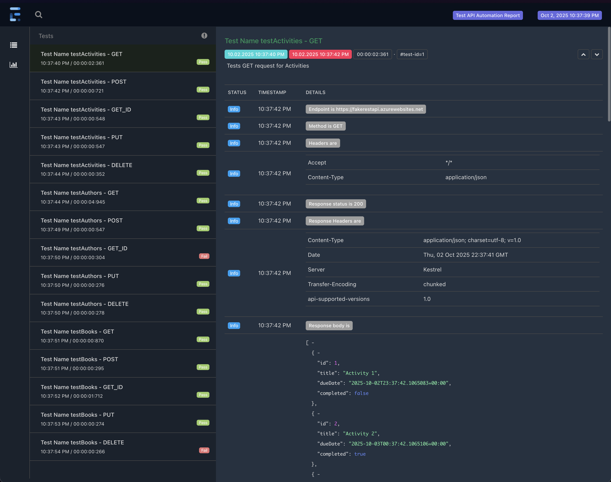

# Online Book Store API Test Automation

[Maven Build and Test](https://github.com/alpiysl/avengaOnlineBookStore/actions/workflows/maven-test.yml)

A comprehensive REST API test automation framework for the Online Book Store application, built with Java, TestNG, RestAssured, and ExtentReports.

## Table of Contents

- [Overview](#overview)
- [Technologies & Tools](#technologies--tools)
- [Project Structure](#project-structure)
- [Prerequisites](#prerequisites)
- [Installation & Setup](#installation--setup)
- [Running Tests](#running-tests)
- [Docker Support](#docker-support)
- [Test Reports](#test-reports)
- [CI/CD Pipeline](#cicd-pipeline)
- [API Endpoints](#api-endpoints)
- [Contributing](#contributing)

## Overview

This project provides automated API testing for the Fake REST API (Online Book Store) hosted at `https://fakerestapi.azurewebsites.net`. The framework tests CRUD operations for three main entities:

- **Activities**
- **Authors**
- **Books**

## Technologies & Tools

| Technology    | Version     | Purpose                       |
| ------------- | ----------- | ----------------------------- |
| Java          | 18          | Programming Language          |
| Maven         | 3.x         | Build & Dependency Management |
| Docker        | Latest      | Containerization              |
| TestNG        | 7.11.0      | Test Framework                |
| RestAssured   | 5.5.6       | API Testing Library           |
| ExtentReports | 5.0.9       | Test Reporting                |
| JavaFaker     | 1.0.2       | Test Data Generation          |
| Lombok        | 1.18.38     | Code Generation               |
| JSON          | 20250517    | JSON Processing               |
| Log4j         | 3.0.0-beta2 | Logging                       |

## Project Structure

```
AVENGA_OnlineBookStore/
├── src/
│   ├── main/
│   │   └── java/
│   │       └── org/
│   │           ├── Activities/       # Activity entity models
│   │           ├── Authors/          # Author entity models
│   │           ├── Books/            # Book entity models
│   │           ├── Endpoints/        # API endpoint definitions
│   │           ├── Reporter/         # ExtentReport configuration
│   │           └── Utils/            # Utility classes (RestUtils, FakerDataUtil, TimeUtil)
│   └── test/
│       ├── java/
│       │   ├── testActivities.java   # Activity API tests
│       │   ├── testAuthors.java      # Author API tests
│       │   └── testBooks.java        # Book API tests
│       └── test.xml                  # TestNG suite configuration
├── .github/
│   └── workflows/
│       ├── maven-test.yml            # Maven CI/CD pipeline
│       └── docker-ci.yml             # Docker CI/CD pipeline
├── Dockerfile                        # Docker image configuration
├── docker-compose.yml                # Docker Compose configuration
├── .dockerignore                     # Docker build exclusions
├── pom.xml                           # Maven configuration
└── README.md                         # Project documentation
```

## Prerequisites

### For Local Execution (Without Docker)

- **Java Development Kit (JDK) 18** or higher
- **Apache Maven 3.6+**
- **Git** (for cloning the repository)
- An IDE (IntelliJ IDEA, Eclipse, or VS Code recommended)

### For Docker Execution

- **Docker** (20.10+)
- **Docker Compose** (1.29+)
- **Git** (for cloning the repository)

## Installation & Setup

### 1. Clone the Repository

```bash
git clone https://github.com/yourusername/AVENGA_OnlineBookStore.git
cd AVENGA_OnlineBookStore
```

### 2. Install Dependencies

```bash
mvn clean install
```

## Running Tests

### Run All Tests

```bash
mvn test
```

### Run Specific Test Suite

```bash
mvn test -DsuiteXmlFile=src/test/test.xml
```

### Test Execution Order

Tests are executed with priorities to ensure proper data flow:

#### Activities Tests (`testActivities.java`)

1. **GET** - Retrieve all activities
2. **POST** - Create a new activity
3. **GET_ID** - Retrieve specific activity by ID
4. **PUT** - Update the activity
5. **DELETE** - Delete the activity

#### Authors Tests (`testAuthors.java`)

Same pattern: GET → POST → GET_ID → PUT → DELETE

#### Books Tests (`testBooks.java`)

Same pattern: GET → POST → GET_ID → PUT → DELETE

### Note on Test Results

**Important:** Some tests are intentionally designed to fail for demonstration and validation purposes. This is done to:

- Showcase the framework's error handling capabilities
- Demonstrate ExtentReports' failure reporting features
- Validate that the CI/CD pipeline correctly handles test failures
- Show how stack traces and error details are captured in reports

The `continue-on-error: true` configuration in the CI/CD pipeline ensures that reports are generated even when tests fail, allowing you to review detailed failure information in the ExtentReports HTML output.

## Docker Support

### Building Docker Image

```bash
docker build -t bookstore-api-tests:latest .
```

### Running Tests with Docker

#### Option 1: Using Docker Run

```bash
# Run with default configuration
docker run --rm bookstore-api-tests:latest

# Run with custom BASE_URL
docker run --rm -e BASE_URL=https://your-api-url.com bookstore-api-tests:latest

# Run and extract reports
docker run --name test-run \
  -v $(pwd)/extent-reports:/app/extent-reports \
  bookstore-api-tests:latest
```

#### Option 2: Using Docker Compose

```bash
# Run tests and generate reports
docker-compose up

# Run in detached mode
docker-compose up -d

# View logs
docker-compose logs -f

# Stop and remove containers
docker-compose down
```

### Environment Variables

The Docker container supports the following environment variables:

| Variable     | Description            | Default Value                           |
| ------------ | ---------------------- | --------------------------------------- |
| `BASE_URL`   | API base URL           | `https://fakerestapi.azurewebsites.net` |
| `TEST_SUITE` | TestNG suite file path | `src/test/test.xml`                     |

### Extracting Reports from Docker

Reports are automatically mounted to your local machine when using docker-compose. For docker run:

```bash
# Copy reports from container
docker cp test-run:/app/extent-reports/. ./extent-reports/
docker cp test-run:/app/target/surefire-reports/. ./target/surefire-reports/
```

## Test Reports

### ExtentReports

After test execution, an HTML report is automatically generated in the `extent-reports/` directory.

#### Report Features:

- Test execution summary (Pass/Fail/Skip)
- Timestamp for each test
- Detailed request/response information
- Request headers and body
- Response status and body
- Exception stack traces for failed tests

#### Sample Report Screenshot



_The report shows detailed test execution with timestamps, status, and comprehensive API request/response details._

## CI/CD Pipeline

The project includes **two automated CI/CD pipelines** using GitHub Actions:

### 1. Maven CI/CD Pipeline (`maven-test.yml`)

Traditional Maven-based pipeline without Docker.

#### Workflow Steps:

1. **Checkout Code** - Clones the repository
2. **Set up JDK 18** - Configures Java environment
3. **Build with Maven** - Compiles the project (`mvn clean compile`)
4. **Run Tests** - Executes all tests (`mvn test`)
5. **Rename Report with Timestamp** - Adds timestamp to the report file
6. **Upload Extent Report** - Saves HTML report as artifact
7. **Upload TestNG Results** - Saves TestNG reports as artifact

### 2. Docker CI/CD Pipeline (`docker-ci.yml`)

Containerized pipeline that builds and runs tests in Docker.

#### Workflow Steps:

1. **Checkout Code** - Clones the repository
2. **Set up Docker Buildx** - Configures Docker build environment
3. **Build Docker Image** - Creates containerized test environment
4. **Run Tests in Container** - Executes tests inside Docker container
5. **Extract Reports** - Copies reports from container to host
6. **Rename Report with Timestamp** - Adds timestamp to the report file
7. **Upload Artifacts** - Saves reports as GitHub artifacts
8. **Cleanup** - Removes containers and images

### Pipeline Triggers

Both pipelines are triggered by:

- Push to `master` branch
- Pull requests to `master` branch
- Manual workflow dispatch

### Accessing Reports from GitHub Actions

1. Go to the **Actions** tab in your repository
2. Click on the workflow run (Maven or Docker)
3. Scroll down to **Artifacts** section
4. Download the report artifact:
   - Maven pipeline: `extent-report-{run-number}.zip`
   - Docker pipeline: `docker-extent-report-{run-number}.zip`
5. Extract and open the HTML file in your browser

### CI/CD Best Practices Implemented

- **Multi-stage Docker builds** for optimized image size
- **Environment variable support** for configuration flexibility
- **Automated report generation** and artifact upload
- **Continue-on-error** for test failures to ensure report generation
- **Containerization** for consistent test execution across environments
- **Parallel pipelines** for both traditional and containerized workflows

## API Endpoints

Base URL: `https://fakerestapi.azurewebsites.net/api/v1/`

## Key Features

### 1. **Data Generation**

- Uses JavaFaker to generate test data
- Formatted timestamps

### 2. **Comprehensive Logging**

- Request/response logging in ExtentReports
- API endpoint, method, headers, and body logging

### 3. **Modular Design**

- Separate utility classes for REST operations
- Entity-specific model classes
- Centralized endpoint management
- Reusable test methods

### 4. **Robust Error Handling**

- Automatic test failure reporting
- Stack trace capture and formatting
